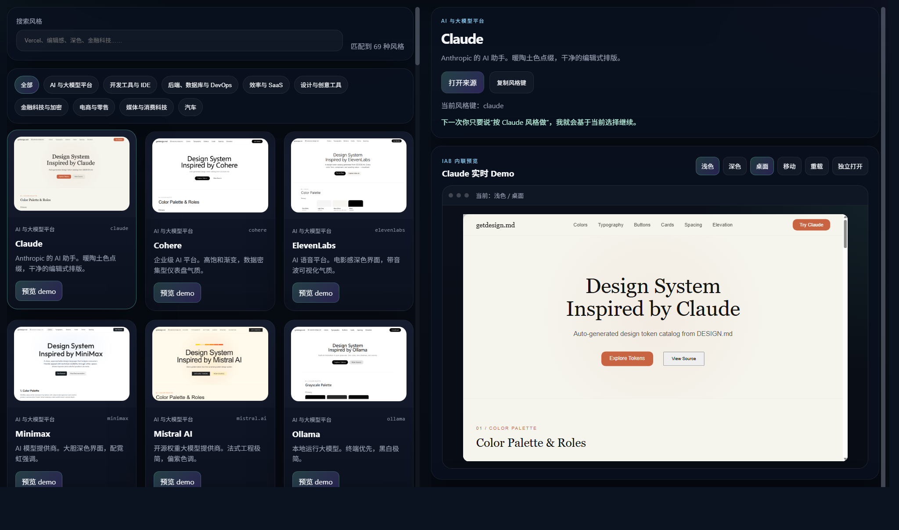

# Awesome DESIGN.md Navigation

基于 [voltagent/awesome-design-md](https://github.com/voltagent/awesome-design-md) 项目的图形化开发视觉导航。

这个 fork 把原项目里的 `DESIGN.md` 风格目录整理成一个可浏览、可搜索、可预览、可交互的本地导航页。目标是在真正开始生成或重做页面之前，先用视觉方式快速选择一种设计风格。



## 功能

- 中文图形化风格总览页。
- 覆盖原目录中的 69 种设计风格。
- 支持搜索、分类筛选和当前风格记忆。
- 每个风格都有真实缩略图。
- 右侧内联交互 demo，可切换浅色/深色、桌面/移动端。
- 本地 mirror 预览，适合在 Codex IAB / 本地浏览器里直接查看。
- 本地 `design-md/<style>/README.md` 已替换为可读设计规范，不再只依赖外部跳转说明。
- 已封装为 Codex skill，可先打开导航页选风格，再让 Agent 按选中的风格继续开发 UI。

## 本地预览

直接打开：

```text
preview-site/index.html
```

或者启动本地静态服务：

```bash
python3 -m http.server 8877 --directory preview-site
```

然后访问：

```text
http://127.0.0.1:8877/index.html
```

URL 会记录当前选择，例如：

```text
http://127.0.0.1:8877/index.html?style=claude&demoTheme=light&demoSize=desktop
```

## Codex Skill

skill 位于：

```text
skills/awesome-design-navigation
```

最简单的安装方式：直接把本仓库地址丢给 Codex，让 Codex 安装这个 skill：

```text
请从 https://github.com/DocWorkBox/awesome-design-Navigation 安装 awesome-design-navigation skill
```

如果需要手动安装，可以使用：

```bash
python ~/.codex/skills/.system/skill-installer/scripts/install-skill-from-github.py \
  --repo DocWorkBox/awesome-design-Navigation \
  --path skills/awesome-design-navigation
```

安装后重启 Codex，然后可以这样使用：

```text
使用 awesome-design-navigation，先打开风格导航页让我选择一个视觉风格。
```

skill 的核心流程：

```text
打开本地预览页 -> 用户选择风格 -> 读取本地 design-md/<style>/README.md -> 必要时读取本地 mirror HTML -> 按该视觉语言生成或修改 UI
```

如果用户已经明确说出风格，例如“按 NVIDIA 风格做”，skill 会直接读取本地规范：

```text
design-md/nvidia/README.md
skills/awesome-design-navigation/assets/design-md/nvidia/README.md
```

## 示例

示例：按 NVIDIA 风格制作的使用说明页：

```text
preview-site/examples/nvidia-skill-guide.html
```

启动本地预览服务后访问：

```text
http://127.0.0.1:8877/examples/nvidia-skill-guide.html
```

这个示例只使用本仓库的本地 skill 说明、本地 `design-md/nvidia/README.md` 和本地 mirror 资产生成，用来验证 skill 的本地优先流程是否可用。

## 包含内容

- `preview-site/`：本地视觉导航站点。
- `design-md/`：本地可读设计规范。
- `skills/awesome-design-navigation/`：可安装到 Codex 的 skill。

## 特别感谢

特别感谢 [voltagent/awesome-design-md](https://github.com/voltagent/awesome-design-md) 原项目。这个仓库的风格目录、DESIGN.md 理念和大量设计风格来源都来自原项目；本 fork 主要是在其基础上增加了图形化预览、交互式导航和 Codex skill 使用流程。

## License

MIT License。详见 [LICENSE](LICENSE)。

本仓库继承原项目的公开资料整理用途。各品牌视觉风格、名称和相关设计资产归其各自权利方所有；这里的内容仅用于帮助开发者和 AI Agent 更快选择、理解和应用设计方向。
